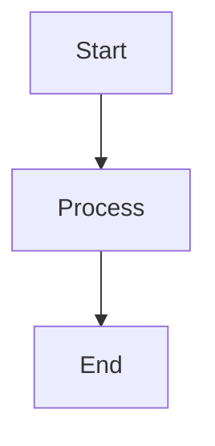

[](https://github.com/aurelienbottazini/markdown-run/actions/workflows/main.yml) [](https://badge.fury.io/rb/markdown-run)

# Markdown-run

Execute code blocks from your markdown files.
Save results to a new code block appended after the initial code block.
Do not rerun code blocks if result block is present.

Meant to be used from the terminal or from an editor with a keybinding.

Supported languages:

- Javascript
- Ruby
- sqlite3
- postgresql
- bash
- zsh
- mermaid (generates SVG diagrams)

## Installation

`gem install markdown-run`

## Usage

- Run specs `markdown-run`
- Run on a markdown file `markdown-run your-filename`

example vscode keybinding

```json
  {
    "key": "ctrl+shift+b",
    "command": "runCommands",
    "args": {
      "commands": [
        {
          "command": "workbench.action.files.save"
        },
        {
          "command": "workbench.action.terminal.sendSequence",
          "args": {
            "text": "markdown-run \"${file}\"\n"
          }
        },
        {
          "command": "workbench.action.files.revert"
        }
      ]
    },
    "when": "editorTextFocus && editorLangId == 'markdown'"
  },
```

### Code block options

- `run=true` or `run=false` to control whether a code block should be executed at all. `run=true` is the default if not specified
- `rerun=true` or `rerun=false` to control whether a code block should be re-executed if a result block already exists. `rerun=false` is the default if not specified
- `result=true` or `result=false` to control whether the result block should be displayed after execution. `result=true` is the default if not specified. When `result=false`, the code still executes but the result block is hidden
- `explain=true` or `explain=false` for psql code blocks to generate query execution plans with Dalibo visualization links. `explain=false` is the default if not specified
- `flamegraph=true` or `flamegraph=false` for psql code blocks to generate PostgreSQL query execution plan flamegraphs as SVG images. `flamegraph=false` is the default if not specified

Options can be combined. If `run=false` is specified, the code block will not execute regardless of the `rerun` setting. The `result` option only affects display of the result block, not code execution.

### Standalone Option Syntax

Options can also be specified using standalone syntax without explicit `=true`:

- `run` is equivalent to `run=true`
- `rerun` is equivalent to `rerun=true`
- `result` is equivalent to `result=true`
- `explain` is equivalent to `explain=true`
- `flamegraph` is equivalent to `flamegraph=true`

Explicit assignments (e.g., `run=false`) take precedence over standalone options.

Examples:

```js run=false
console.log("This will not execute at all");
```

```js rerun
console.log("This will re-execute even if result exists");
```

```js run=true rerun=false
console.log("This will execute only if no result exists");
```

```ruby result=false run
puts "This executes but the result block is hidden"
```

```psql explain
SELECT * FROM users WHERE id = 1;
```

```psql explain=true
EXPLAIN (ANALYZE) SELECT * FROM large_table;
```

```psql flamegraph
SELECT u.name, COUNT(o.id) as order_count
FROM users u
LEFT JOIN orders o ON u.id = o.user_id
WHERE u.created_at > '2024-01-01'
GROUP BY u.id, u.name
ORDER BY order_count DESC
LIMIT 10;
```

```psql flamegraph=true result=false
-- This will generate a flamegraph but hide the JSON result block
SELECT * FROM complex_query_with_joins;
```

```psql result=false explain
SELECT * FROM large_table;
-- This will execute the explain query and show the Dalibo link but hide the result block
```

### PostgreSQL Flamegraphs

PostgreSQL flamegraph blocks generate interactive SVG flamegraphs from query execution plans:

```psql flamegraph
SELECT users.*, orders.total
FROM users
JOIN orders ON users.id = orders.user_id
WHERE users.created_at > '2024-01-01';
```

This generates:

- An SVG flamegraph file in a directory named after the markdown file
- Filename format: `my-document-flamegraph-20250118-143022-a1b2c3.svg`
- Embedded image tag: ``

**Flamegraph features:**

- **Interactive**: Hover over rectangles to see detailed timing information
- **Color-coded**: Different colors for operation types (red=seq scans, green=index scans, blue=joins, etc.)
- **Hierarchical**: Shows query plan structure visually
- **Performance insights**: Width represents execution time, making bottlenecks immediately visible

**What flamegraphs help identify:**

- Slow operations (widest rectangles)
- Query plan structure (nested relationships)
- Inefficient operations (color-coded by type)
- Execution time distribution across plan nodes

### Mermaid diagrams

Mermaid blocks generate SVG files and insert markdown image tags:



This generates an SVG file in a directory named after the markdown file, with a filename that includes the markdown file's basename and a timestamp:

- Directory: `my-document/` (if the markdown file is `my-document.md`)
- Filename: `my-document-20250602-215507-a1289a799c29.svg`
- Image tag: ``

Note: Requires `@mermaid-js/mermaid-cli` to be installed: `npm install -g @mermaid-js/mermaid-cli`

## Frontmatter

You can add a yaml frontmatter to redefine code block behavior.

For example sql blocks run by default against sqlite
To have them run with postgres you can add at the top of your markdown file:

```yaml
markdown-run:
  alias:
    - sql: psql
```

### Setting Defaults

You can override the default behavior for code block options using frontmatter:

```yaml
markdown-run:
  defaults:
    rerun: true
    result: false
  psql:
    explain: true
  ruby:
    rerun: false
```

**Priority order (highest to lowest):**

1. Explicit options in code blocks (e.g., `rerun=true`)
2. Language-specific defaults (e.g., `psql: { explain: true }`)
3. Global defaults (e.g., `defaults: { rerun: true }`)
4. Built-in application defaults

**Available options for defaults:**

- `run`: Control whether code blocks execute (default: `true`)
- `rerun`: Control whether to re-execute if result exists (default: `false`)
- `result`: Control whether to show result blocks (default: `true`)
- `explain`: For psql blocks, generate explain plans (default: `false`)
- `flamegraph`: For psql blocks, generate flamegraph SVGs (default: `false`)

**Examples:**

Make all code blocks rerun by default:

```yaml
markdown-run:
  defaults:
    rerun: true
```

Hide result blocks by default but enable explain for psql:

```yaml
markdown-run:
  defaults:
    result: false
  psql:
    explain: true
```

Enable flamegraphs by default for all psql blocks:

```yaml
markdown-run:
  psql:
    flamegraph: true
```

Language-specific settings override global defaults:

```yaml
markdown-run:
  defaults:
    rerun: false # Global default
  ruby:
    rerun: true # Ruby blocks will rerun, others won't
```

## Demo


## Development

Just run the script with `./exe/markdown-run`

## Contributing

Bug reports are welcome on GitHub at https://github.com/aurelienbottazini/markdown-run.

## License

The gem is available as open source under the terms of the [MIT License](https://opensource.org/licenses/MIT).

## [Code of conduct](https://github.com/aurelienbottazini/markdown-run/blob/main/CODE_OF_CONDUCT.md).
