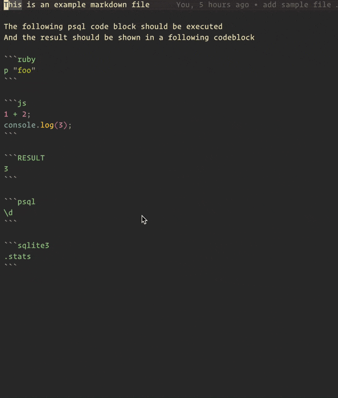

[](https://github.com/aurelienbottazini/markdown-run/actions/workflows/main.yml) [](https://badge.fury.io/rb/markdown-run)

# Markdown-run

Execute code blocks from your markdown files.
Save results to a new code block appended after the initial code block.
Do not rerun code blocks if result block is present.

Meant to be used from the terminal or from an editor with a keybinding.

Supported languages:

- Javascript
- Ruby
- sqlite3
- postgresql
- bash
- zsh

## Installation

`gem install markdown-run`

## Usage

- Run specs `markdown-run`
- Run on a markdown file `markdown-run your-filename`

example vscode keybinding

```json
  {
    "key": "ctrl+shift+b",
    "command": "runCommands",
    "args": {
      "commands": [
        {
          "command": "workbench.action.files.save"
        },
        {
          "command": "workbench.action.terminal.sendSequence",
          "args": {
            "text": "markdown-run \"${file}\"\n"
          }
        },
        {
          "command": "workbench.action.files.revert"
        }
      ]
    },
    "when": "editorTextFocus && editorLangId == 'markdown'"
  },
```

### Code block options

- `rerun=true` or `rerun=false` for a code block to rerun or skip execution. `rerun=true` is the default if not specified

example:

```js rerun=false
console.log("hello world");
```

## Frontmatter

You can add a yaml frontmatter to redefine code block behavior.

For example sql blocks run by default against sqlite
To have them run with postgres you can add at the top of your markdown file:

```yaml
markdown-run:
  alias:
    - sql: psql
```

## Demo



## Development

Just run the script with `./exe/markdown-run`

## Contributing

Bug reports are welcome on GitHub at https://github.com/aurelienbottazini/markdown-run.

## License

The gem is available as open source under the terms of the [MIT License](https://opensource.org/licenses/MIT).

## [Code of conduct](https://github.com/aurelienbottazini/markdown-run/blob/main/CODE_OF_CONDUCT.md).
